# AWS Machine Learning Cheat Sheet

<a href="https://www.linkedin.com/in/ryanxjhan/" target="_blank">LinkedIn</a>

### Table of Contents

* [Overview](#overview)
* [Data Engineering](#engi)
  * [Data Repositories](#repo)
  * [Data Ingestion](#ingest)
  * [Data Transformation](#transform)
* [Exploratory Data Analysis](#eda)
* [Modelling](#model)
* [ML Implementation and Operations](#op)

<a name="overview"/>

### Overview

| Duration | Questions    | Formats                             |
| -------- | ------------ | ----------------------------------- |
| 170 mins | 65 questions | Multiple choice & multiple response |

 

<a name="engi"/>

### Data Engineering

<a name="repo"/>

#### Data Repositories

1. ***AWS Lake Formation***

   AWS Lake Formation is a service that makes it easy to set up a secure data lake in days. 

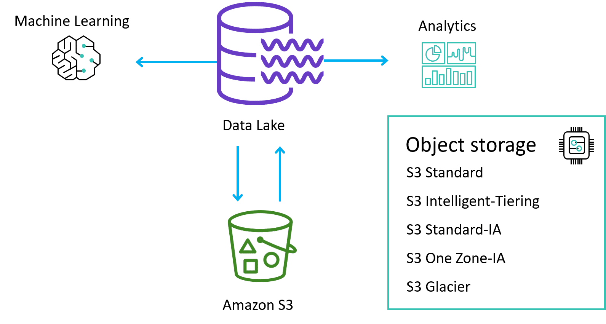

2. ***AWS S3***

   Amazon Simple Storage Service (Amazon S3) is an object storage service that offers industry-leading scalability, data availability, security, and performance.

| Storage Classes      | Use cases                              | Availability Zones | Access  Time     |
| -------------------- | -------------------------------------- | ------------------ | ---------------- |
| S3 Standard          | For active, frequently accessed data   | >= 3               | Milliseconds     |
| S3 INT               | For data with changing access patterns | >= 3               | Milliseconds     |
| S3 S-IA              | For infrequently accessed data         | >= 3               | Milliseconds     |
| S3 1Z-IA             | For re-creatable, less accessde data   | 1                  | Milliseconds     |
| Amazon Glacier       | For archive data                       | >=3                | Minutes or hours |
| Glacier Deep Archive | For lowest storage cost                | >=3                | 12 - 48 hours    |

**Amazon S3 with Amazon SageMaker**

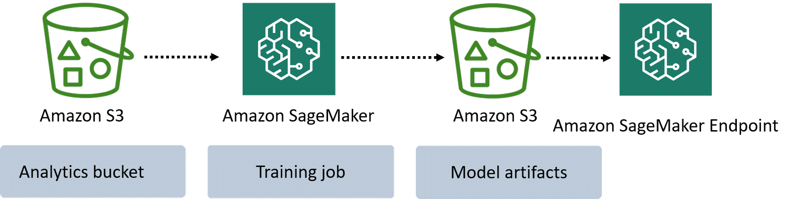

You can use Amazon S3 while you’re training your ML models with Amazon SageMaker. Amazon S3 is integrated with Amazon SageMaker to store your training data and model training output.

3. ***Amazon FSx for Lustre***

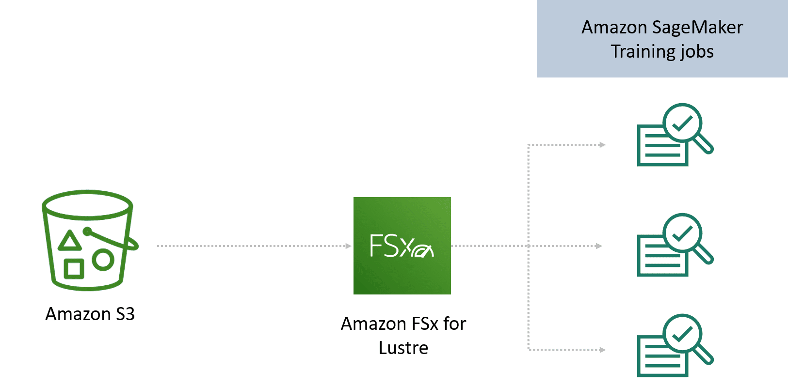

When your training data is already in Amazon S3 and you plan to run training jobs several times using different algorithms and parameters, consider using Amazon FSx for Lustre, a file system service. FSx for Lustre speeds up your training jobs by serving your Amazon S3 data to Amazon SageMaker at high speeds. The first time you run a training job, FSx for Lustre automatically copies data from Amazon S3 and makes it available to Amazon SageMaker. You can use the same Amazon FSx file system for subsequent iterations of training jobs, preventing repeated downloads of common Amazon S3 objects.

4. ***Amazon S3 with Amazon EFS***

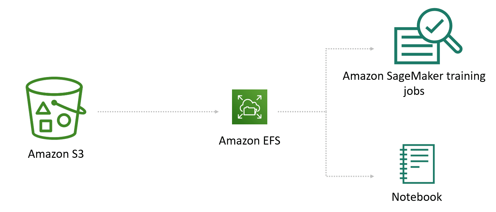

Alternatively, if your training data is already in Amazon Elastic File System (Amazon EFS), we recommend using that as your training data source. Amazon EFS has the benefit of directly launching your training jobs from the service without the need for data movement, resulting in faster training start times. This is often the case in environments where data scientists have home directories in Amazon EFS and are quickly iterating on their models by bringing in new data, sharing data with colleagues, and experimenting with including different fields or labels in their dataset. For example, a data scientist can use a Jupyter notebook to do initial cleansing on a training set, launch a training job from Amazon SageMaker, then use their notebook to drop a column and re-launch the training job, comparing the resulting models to see which works better.

1. ***Amazon EBS***

   Amazon Elastic Block Store (EBS) is an easy to use, high-performance, block-storage service designed for use with Amazon Elastic Compute Cloud (EC2) for both throughput and transaction intensive workloads at any scale.

<a name="ingest"/>

#### Data Ingestion

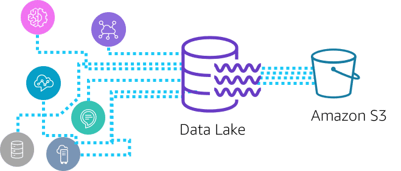

1. ***Batch Processing***

   For batch ingestions to the AWS Cloud, you can use services like AWS Glue, an ETL (extract, transform, and load) service that you can use to categorize your data, clean it, enrich it, and move it between various data stores. AWS Database Migration Service (AWS DMS) is another service to help with batch ingestions. This service reads from historical data from source systems, such as relational database management systems, data warehouses, and NoSQL databases, at any desired interval. You can also automate various ETL tasks that involve complex workflows by using AWS Step Functions.

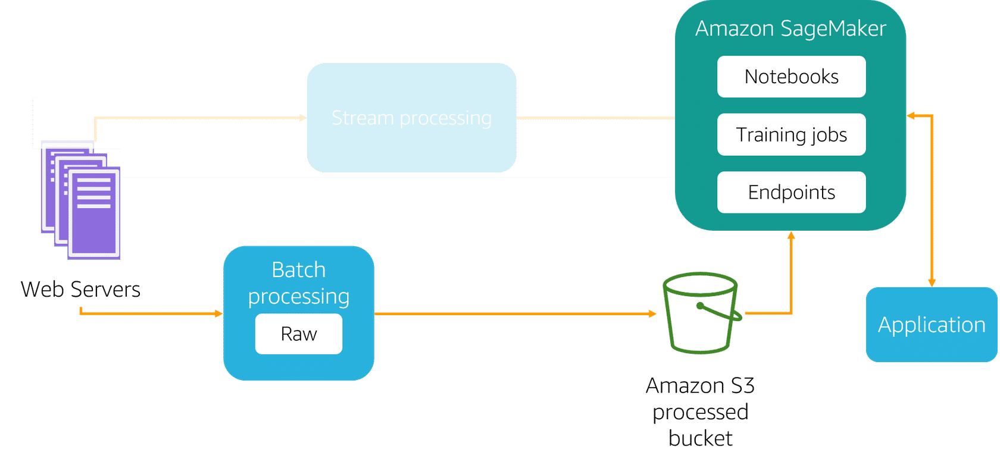

1. ***Stream Processing***

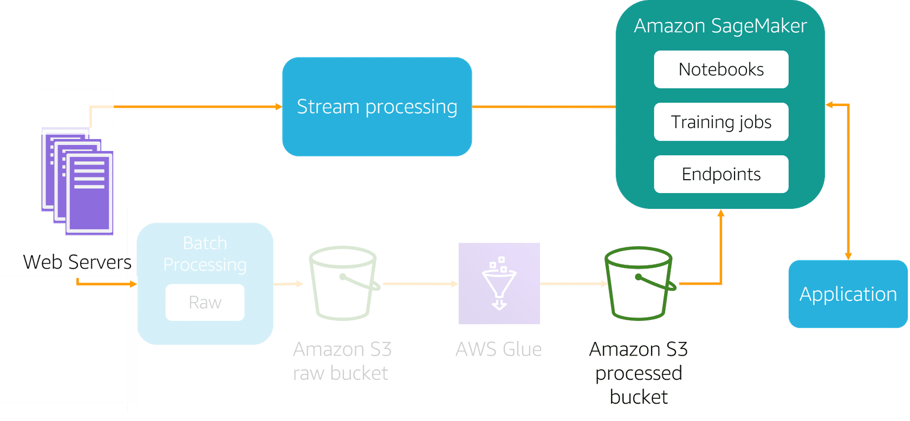

Stream processing, which includes real-time processing, involves no grouping at all. Data is sourced, manipulated, and loaded as soon as it is created or recognized by the data ingestion layer. This kind of ingestion is less cost-effective, since it requires systems to constantly monitor sources and accept new information. But you might want to use it for real-time predictions using an Amazon SageMaker endpoint that you want to show your customers on your website or some real-time analytics that require continually refreshed data, like real-time dashboards.

**Amazon Kinesis**

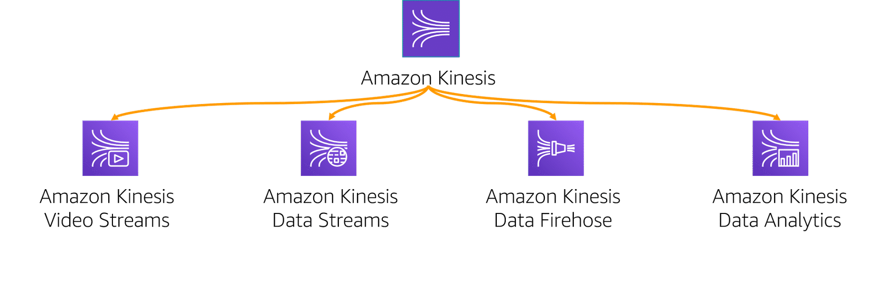

1. Video Streams: ingest and analyze video and audio data.
2. Data Streams: use Kinese Producer Library to ingest data and use Kinesis Client Library to develop custom cunsumer applicaitons that can process data from KDS.
3. Data Firehose: batch, compress, and execute custom transformation logic (AWS Lambda) data.
4. Data Analytics: process and transform data through KDS or KDF using SQL near-real time.

**AWS Glue**

AWS Glue is a serverless ETL service that makes it easy to discover, prepare, and combine data for analytics, machine learning, and application development.

1. ETL

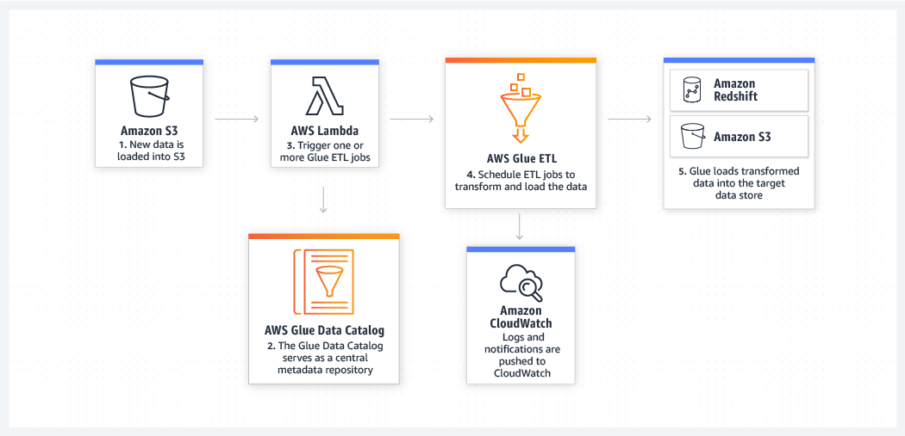

2. Unified Data Catalog

**Amazon MSK (Managed Streaming for Apache Kafka)**

Amazon MSK is a fully managed service that makes it easy for you to build and run applications that use [Apache Kafka](https://aws.amazon.com/streaming-data/what-is-kafka/) to process streaming data. Apache Kafka is an open-source platform for building real-time streaming data pipelines and applications. With Amazon MSK, you can use native Apache Kafka APIs to populate data lakes, stream changes to and from databases, and power machine learning and analytics applications.

<a name="transform"/>

#### Data Transformation

**Amazon EMR**

Amazon EMR is the industry-leading cloud big data platform for processing vast amounts of data using open source tools such as [Apache Spark](https://aws.amazon.com/emr/features/spark/), [Apache Hive](https://aws.amazon.com/emr/features/hive/), [Apache HBase](https://aws.amazon.com/emr/features/hbase/), [Apache Flink](https://aws.amazon.com/blogs/big-data/use-apache-flink-on-amazon-emr/), [Apache Hudi](https://aws.amazon.com/emr/features/hudi/), and [Presto](https://aws.amazon.com/emr/features/presto/). 

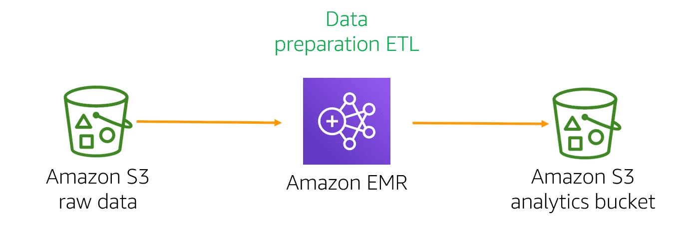

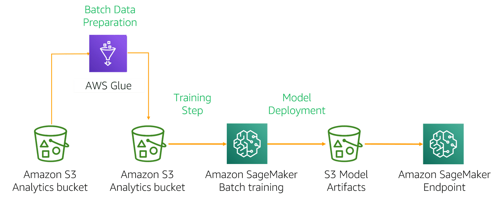

<a name="eda"/>

### Exploratory Data Analysis

1. ***Preprocessing***

**Amazon SageMaker Ground Truth**

Amazon SageMaker Ground Truth is a fully managed [data labeling](https://aws.amazon.com/sagemaker/groundtruth/what-is-data-labeling/) service that makes it easy to build highly accurate training datasets for machine learning. 

2. ***Feature Engineering***

   **Dimension Reduction**

   * t-Distributed Stochastic Neighbor Embedding (t-SNE)
   * Principal Component Analysis (PCA)

3. ***Visualization***

<a name="model"/>

### Modelling

***Amazon SageMaker***

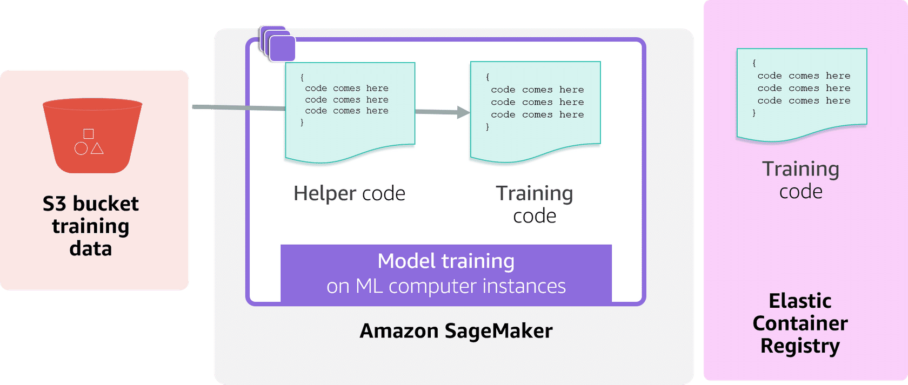

***Amazon SageMaker Estimators***

* Local mode: without loading training data
* Pipe mode: improve loading time 

***Amazon SageMaker DeepAR Forecasting Algoirthm***

The Amazon SageMaker DeepAR forecasting algorithm is a supervised learning algorithm for forecasting scalar (one-dimensional) **time series** using recurrent neural networks (RNN).

***Amazon EC2 P3 Instances***

Amazon EC2 P3 instances deliver high performance compute in the cloud with up to 8 NVIDIA® V100 Tensor Core GPUs and up to 100 Gbps of networking throughput for machine learning and HPC applications.

***Hyperparameters Tuning***

* Grid Search 
* Random Search
* Amazon SageMaker Automated Hyperparameter Tuning

***Metrics***

Precision: TP/(TP+FP)

Recall/Sensitivity: TP/(TP+FN)

Specificity: TN/(TN+FP)

<a name="op"/>

### ML Implementation and Operations

***Queues***

**Amazon SQS**

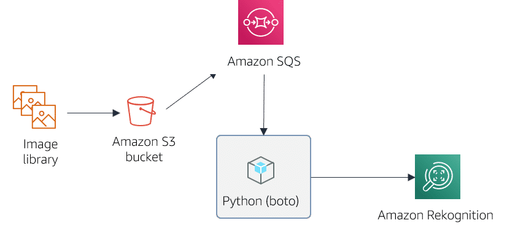

**Amazon CloudWatch**

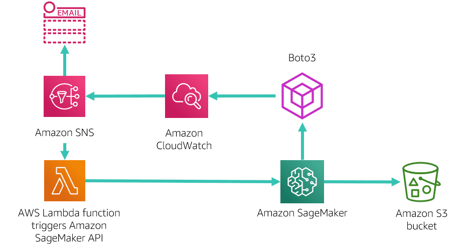

**AWS CloudTrail**

AWS CloudTrail captures API calls and related events made by or on behalf of your AWS account and delivers the log files to an Amazon S3 bucket that you specify.

